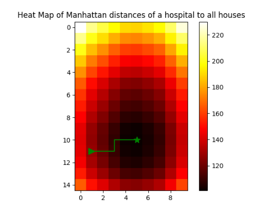

# Homes and Hospitals
The project visualizes the state-space landscape of cost function for the case of optimization of distance to houses at the presence of one hospital only.
The heat map visualisation calculates according to the Graph that is calculated as sum of Manhattan distances of  one hospital to all generated the houses.

## Content
- [Homes and Hospitals](#homes-and-hospitals)
  - [Content](#content)
  - [Using additional features](#using-additional-features)
  - [Authors](#authors)

## Using additional features
We can show the optimization process on the heat map, as a line segments connecting initial configuration of the hospital to final solution (local minima).

To perform we such an option we need to set hospitals number to 1 in line:
```python
s = Space(height=15, width=10, num_hospitals=1)
``` 




## Authors
Andrei Kotkov (andrei.kotkov@student.put.poznan.pl)